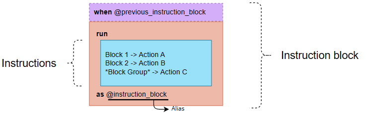
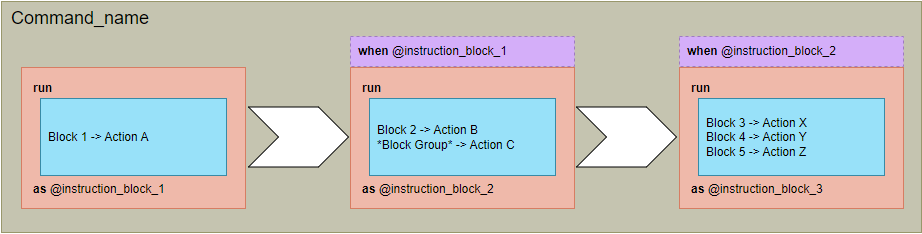
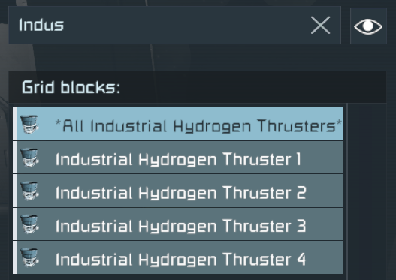
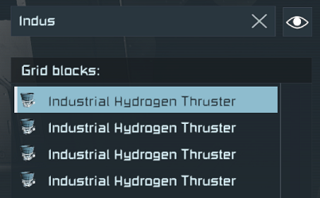
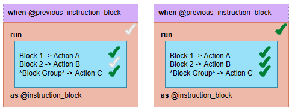
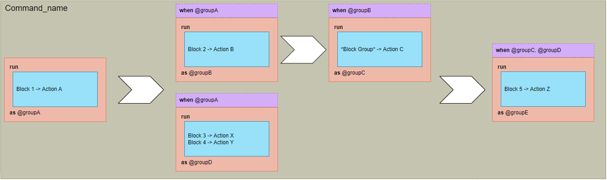
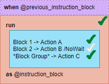
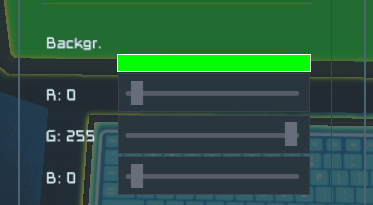

# SequentialScript (User documentation)

- [About](#about)
- [Syntax](#syntax)
    - [Blocks](#blocks)
    - [Sequence](#sequence)
    - [Argumens](#arguments)
    - [Comments](#comments)
- [Action list](#action-list)
- [Known issues](#known-issues)
- Examples
    - [Hydrogen charger](Examples_Hydrogen_Charger.md)
    - [Pressurized Door](Examples_Pressurized_Door.md)

---

## About

This script allows creating complex sequences that typically require **multiple timer blocks** by using **only one programming block** and writing some instructions in its "Custom Data" section.

For example, it is possible to command button that depressurize the room before open the door.

```
[OPEN_DOOR]
run
 Air Vent -> Depressurize
as @room_depressurized

when @room_depressurized
 Door -> Enable
 Door -> Open
@as @door_opened
```

Other example is a hinge starting to move after some piston is fully extended.
```
[PISTON_ROTOR]
run
 Piston -> Extend
as @piston_extended

when @piston_extended
run
 Hinge -> Forward
as @hinge_moved

```

---

## Syntax

The syntax is divided into the following elements:
- **Command**: It is the name of the set of actions to be performed.
- **Instruction block**: It is a set of actions that should start simultaneously. It would be the equivalent of a **Timer Block**. Instruction blocks can be initiated when the command is executed or upon the completion of other instruction blocks.
- **Instruction**: Actions that must be carried out within the instruction block. It would be the equivalent of the actions placed inside a **Timer Block**. Actions are defined in the following [table](#action-list).





### Blocks
In the **instruction** region, it is possible to set individual blocks or groups.

Individual block:
```
Industrial Hydrogen Thruster -> Action
```

Block group:
```
*All Industrial Hydrogen Thrusters* -> Action
```


If there are many blocks with the same name, individual block name will apply to all of them.
```
Industrial Hydrogen Thruster -> Enable
```



### Sequence

An **instruction block** enters in finished state when all the instructions have met their finish condition.



All **instruction blocks** must have an *alias*. This alias can be used for other **instruction blocks** to set that it cannot start until this one has finished.

Use the clausule *when* to set a **instruction block** wait until one or more **instruction blocks** have finished. 
```
when @previous_action1
run
 <actions>
as @action_block
```

If a **instruction block** must run at the begining of the command, then omit the when clausule.
```
run
 <actions>
as @first_block
```

If the **instruction block** must wait for many other **instruction blocks**, set all aliases split by commas.
```
when @previous_action1, @previous_action2
run
 <actions>
as @action_block
```

It is also possible to run multiple **instruction blocks** when one **instruction block** has finished.
```
run
 <actions>
as @first_block

when @first_block
run
 <actions>
as @second_block

when @first_block
run
 <actions>
as @thrid_block
```

The following example is a mix of all previous cases:
```
[COMMAND_NAME]
run
 Block 1 -> Action A
as @groupA

when @groupA
run
 Block 2 -> Action B
as @groupB

when @groupB
run
 *Block Group* -> Action C
as @groupC

when @groupA
run
 Block 3 -> Action X
 Block 4 -> Action Y
as @groupD

when @groupC, @groupD
run
 Block 5 -> Action Z
as @groupE
```



### Arguments
Actions can have arguments
```
run
 Block -> Action /Argument1 /Argument2:MyValue /Argument3:"My value with spaces"
as @action_block
```

#### NoWait
Sometimes it is not necessary that an action ends to consider that the **instruction block** has finished. In those cases, it is possible to set "/NoWait" argument:
```
when @previous_instruction_block
run
 Block 1 -> Action A
 Block 2 -> Action B /NoWait
 *Block group* -> Action C
as @instruction_block
```



#### Wait
In a similar way, it is possible to set the maximun time (in milliseconds) that the action must wait to consider that is has finished. If the actions ends before, then it will be taken in consideration, else, it will be ignored.

The following example waits that the block has depressurized up to 3 seconds. If the room needs 1 second to depressurize, the door will opens in that moment, but if the room needs more than 3 seconds, the door will open anyway when time expires.
```
run
 Air Vent 1 -> Depressurize /Wait:3000
as @room_depressurized

when @room_depressurized
run
 Door 1 --> Open
as @done
```

#### Custom-defined arguments by action
Some actions have their own arguments. Those arguments are defined in the [action list](#action-list).


### Comments

Sometimes it is necessary to write text in the sequence to explain what is it doing. It is possible to write "human text" typing // before.
```
[COMMAND_NAME]
// Start automatically.
run
 Interior Light 1 -> Enable
 Piston 1 -> Extend // Extends piston and waits until it arrives to the max value.
as @piston_extended

// Starts when piston is fully extended.
when @piston extended
run
 Interior Ligth 1 -> Disable
 // Hinge max degrees is 90º.
 Hinge 1 -> Forward
 Hinge 2 -> Forward
as @done
```

---

## Action list

| Block type                    | Action name            | Description                                                      | Finish condition                                                                                 | Arguments             | Remarks                                                              |
| ----------------------------- | ---------------------- | ---------------------------------------------------------------- | ------------------------------------------------------------------------------------------------ | --------------------- | -------------------------------------------------------------------- |
| Any functional block          | Enable / On            | Switches on the block                                            | Block enabled                                                                                    |                       |                                                                      |
|                               | Disable / Off          | Switches off the block                                           | Block disabled                                                                                   |                       |                                                                      |
| Door (all types)              | Open                   | Opens the door                                                   | Door fully opened                                                                                |                       |                                                                      |
|                               | Close                  | Closes the door                                                  | Door fully closed                                                                                |                       |                                                                      |
| Air Vent                      | Pressurize             | Changes block mode to pressurize mode                            | Block status is 'pressurized'                                                                    |                       |                                                                      |
|                               | Depressurize           | Changes block mode to depressurize mode                          | Oxygen level is 0                                                                                |                       |                                                                      |
| Oxygen / Hydrogen Tank        | Stockpile              | Forces to the tank to fill itself<br>It will not release any gas | Stockpile mode enabled and tank fully filled                                                     |                       |                                                                      |
|                               | Auto                   | Tank loads and unloads gas automatically                         | Stockpile mode disabled                                                                          |                       |                                                                      |
| Merge block                   | Enable / On / Lock     | Switches on the block                                            | Merge state is locked (green color)                                                              |                       |                                                                      |
|                               | Disable / Off / Unlock | Switches off the block                                           | Merge state is not locked (not green color)                                                      |                       |                                                                      |
| Connector                     | Connect / Lock         |                                                                  | Connector is connected (green color)                                                             |                       |                                                                      |
|                               | Disconnect / Unlock    |                                                                  | Connector is not connected (not green color)                                                     |                       |                                                                      |
| Rotor                         | Forward                | Sets positive displacement                                       | Movement is positive<br>If upper limit is set, it checks that the angle has reached to the limit |                       |                                                                      |
|                               | Back                   | Sets negative displacement                                       | Movement is negative<br>If lower limit is set, it checks that the angle has reached to the limit |                       |                                                                      |
| Piston                        | Extend                 | Sets positive displacement                                       | Piston is fully extended                                                                         |                       |                                                                      |
|                               | Retract                | Sets netative displacement                                       | Piston is fully retracted                                                                        |                       |                                                                      |
| Sound block / Jukebox         | Play                   | Starts sound                                                     | Immediately                                                                                      |                       |                                                                      |
|                               | Stop                   | Stops sound                                                      | Immediately                                                                                      |                       |                                                                      |
| Timer block                   | Start                  | Begins timer countdown                                           | Timer countdown ends                                                                             |                       |                                                                      |
|                               | Stop                   | Stops current timer countdown                                    | Timer countdown stops                                                                            |                       |                                                                      |
|                               | Trigger                | Triggers timer inmediatelly, skips<br>countdown                  | Immediately                                                                                      |                       |                                                                      |
| Programmable block            | Run                    |                                                                  | Programable block ends running                                                                   |                       |                                                                      |
| Battery                       | Recharge               |                                                                  | Battery is fully charged                                                                         |                       |                                                                      |
|                               | Discharge              |                                                                  | Battery is empty                                                                                 |                       |                                                                      |
|                               | Auto                   |                                                                  | Immediately                                                                                      |                       |                                                                      |
| Light (all types)             | Set                    | Changes some property or properties in the block                 | All properties already changed                                                                   |                       |                                                                      |
|                               |                        |                                                                  |                                                                                                  | /COLOR:\<color\>      | Sets the light color<br>See [color](#color) type                     |
| LCDs & other display surfaces | Display                | Changes some property or properties in the block                 | All properties already changed                                                                   |                       |                                                                      |
|                               |                        |                                                                  |                                                                                                  | /INDEX:\<number\>     | Required if the block has several displays (like cockpits)           |
|                               |                        |                                                                  |                                                                                                  | /BACKGROUND:\<color\> | Sets the background color of the display<br>See [color](#color) type |
|                               |                        |                                                                  |                                                                                                  | /COLOR:\<color\>      | Sets the text color of the display<br>See [color](#color) type       |
|                               |                        |                                                                  |                                                                                                  | /TEXT:\<string>       | Sets the text to show in the display                                 |

**Trick:** If there are some action that is not in the *action list*, is is possible to use a timer block. Build a timer block, add the action (or actions) and run it using the following sentence. This will run the timer block actions when the previous **instruction block** has finished.
```
when @previous_instruction_block
run
 My Timer Block -> Trigger
as @instruction_block
```

## Color
Some actions allows to change the color (for example lights and LCDs).

There are several ways to set the color:

| Type | Format                 | Remarks                                                                   |
| ---- | ---------------------- | ------------------------------------------------------------------------- |
| Name | /COLOR:RED             | Sets the light color with the specified name.                             |
| Html | /COLOR:#FF0000         | Sets the light color with the specified html hex code                     |
| RGB  | /COLOR:250;128;114     | Sets the light color with the specified RGB color (RED;GREEN;BLUE)        |
| ARGB | /COLOR:200;250;128;114 | Sets the light color with the specified ARGB color (ALPHA;RED;GREEN;BLUE) |

Space Engineers uses RGB option ingame:



**Warning:** due of Space Engineers limitations, some colors may not display properly. The best way to choose a color is testing it ingame before.

## Known issues

**Issue 1**

*Message:* Script execution terminated, script is too complex. Please edit and rebuild script.

*Description:* Occurs when the command has too many instructions.